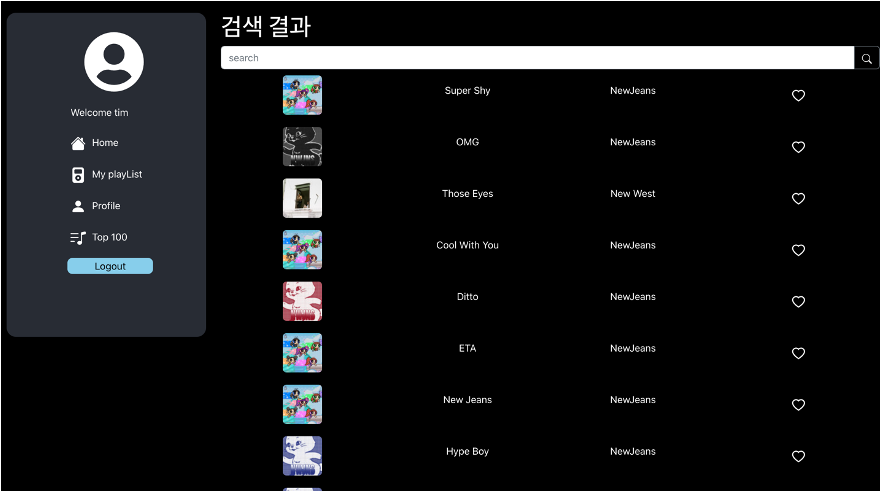

# MRW 음악 추천 웹사이트

### 주제 선정

Spotify API를 이용해 음악 데이터 시각화 프로젝트를 진행 후 다양한 음악 데이터들을 이용해 더 발전한 프로젝트를 진행하고자하여 음악 추천 서비스를 구현하자 라는 생각을 하고 진행하였습니다.

사용자가 선호하는 음악들을 이용하여 유사한 음악 아티스트, 장르 등을 추천해주는 서비스를 Spotify API에서 제공해 주는 데이터를 이용하여 구현하였습니다.

### 목표

- 회원의 개인 별 데이터를 구성하여 회원의 데이터를 통해 추천 시스템 구현
- 동적 쿼리를 이용한 효율적인 통합 검색 서비스 구현
- 단순한 노래 뿐 아니라 다른 음악 컨텐츠 추천
- 다른 기능을 하는 시스템과의 통합
- 사용자의 취향에 비슷한 추천 결과값을 제공

### 시스템 구성

## 기능 구현

### 로그인, 회원 가입

- Spring Security를 사용하여 로그인 및 회원 가입을 구현
- BCrypt hashing 암호화 알고리즘을 사용하여 비밀번호를 암호화

### 선호화는 아티스트 고르기

- 회원 가입 후 최초 로그인 시 선호하는 아티스트를 고른다.
- 이는 최초 로그인 시 회원의 플레이리스트가 존재하지 않을 때 이 페이지에서 회원이 고른 아티스트를 기반으로 추천이 이루어진다.

### 플레이리스트 추가

- 노래를 검색하거나 추천되는 노래의 하트 버튼을 눌러 플레이리스트에 추가할 수 있다.
- My Playlist페이지에서 자신이 추가한 플레이리스트를 확인할 수 있다.
- 플레이리스트가 추가된 시점부터 추천은 플레이리스트를 기준으로 진행된다.

### 프로필 페이지

- 프로필 페이지에서는 자신이 선호하는 아티스트 선호하는 장르를 알 수 있다.
- 플레이리스트가 존재하지 않는다면 처음에 골랐던 아티스트를 기준으로 화면에 표시가 된다.

### 검색 페이지

- 음악 검색 시 아티스트의 이름, 음악의 제목 등으로 검색이 가능하다. 해당 검색어와 관련된 모든 정보를 알 수 있다. Querydsl을 통해 동적쿼리를 생성하여 노래의 제목, 아티스트의 이름으로 통합 검색이 가능하도록 구현하였다.
- 검색 페이지에서 하트버튼으로 플레이리스트에 추가가 가능하다.

## 추천 기능 구현

### 추천 음악

선호하는 아티스트, 플레이리스트에 있는 음악에 따라 음악이 추천된다.

### 추천 플레이리스트

Spotify에 있는 플레이리스트를 사용자의 플레이리스트와 비교하여 추천한다.

### 추천하는 장르

사용자의 플레이리스트에 가장 많이 있는 장르를 추출하고 해당 장르에 맞는 플레이리스트를 추천한다.

### 추천 아티스트

사용자의 플레이리스트를 분석하여 플레이리스트의 특징들을 추출 후, 다른 아티스트의 대표곡들과 비교한다. 가장 유사한 아티스트를 추천해주고 노래들을 추천해준다.

### 추천 시스템 추천 방식

장르 별로 음악의 특징을 일정한 범위로 데이터를 표준화를 시켜 일정한 범위의 특징의 빈도수를 세어 표준화된 데이터의 분포도를 파악한다.

만약 표준화된 데이터에서 특정 특징이 양의 값으로 몰려 있다면, 해당 특징이 해당 데이터 집합에서 유의미한 특징 또는 패턴을 나타낸다고 볼 수 있다.

따라서 유의미한 특징을 위와 같은 방식으로 파악 후 해당하는 특징에 가중치를 부여하여 비슷한 노래를 추천할 수 있도록 하였다.

예를 들어, 클래식의 경우 “acousticness”, “instrumentalness”, “loudness” 들이 양의 값으로
몰려 있는데, 이 특징은 해당 음악 장르와 관련된 패턴 또는 특성을 나타내는 것으로 해석할 수 있다.

만약 여러 장르가 플레이리스트에 존재한다면 플레이리스트에 가장 많이 존재하는 장르를 추출 후 해당 장르의 표준화를 이용하여 유의미한 특징을 찾는다.

그 후 해당 특징에 가중치를 적용하여 사용자가 좋아하는 분위기에 음악을 찾아 비슷한 노래를 추천할 수 있다.
